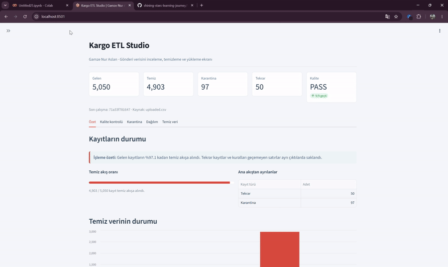

# 🚚 Week 5 — Data Engineering & Apache Airflow

Bu hafta **Veri Mühendisliği**, **ETL pipeline mantığı**, **Docker & PostgreSQL**, **idempotency**, **veri kalitesi** ve **Apache Airflow’un veri süreçlerindeki rolü** üzerine çalıştım.

Haftanın uygulamasında ise sentetik kargo verisi üretiminden başlayıp temiz verinin PostgreSQL’e güvenli şekilde aktarılmasına kadar uzanan küçük bir **uçtan uca veri pipeline’ı** oluşturdum. 

<p align="center">
  
</p>

---

## 🧩 Pipeline Akışı

```text
🎲 Faker
   ↓
📄 Ham Veri
   ↓
🔍 Veri Keşfi
   ↓
🧹 Temizleme
   ├── ✅ Temiz Veri
   └── 🚨 Karantina
   ↓
🐘 PostgreSQL
   ↓
🔁 Idempotent Load
   ↓
🧪 Data Quality Check
```

---

## 🎲 Sentetik Veri Üretimi

Gerçek veri yerine **Faker (`tr_TR`)** kullanarak kargo gönderi verileri oluşturdum.

Veri setinde:

* 📦 Gönderi ID
* 🏢 Şube kodu
* 📍 Alıcı şehri
* ⚖️ Ağırlık
* 🚚 Gönderi durumu
* 📅 Kabul ve teslim tarihleri

bulunuyor.

Pipeline’ı test edebilmek için veriye bilinçli olarak duplicate kayıtlar, eksik değerler, geçersiz ağırlıklar, hatalı tarihler ve farklı İstanbul yazımları ekledim.

```text
Ham veri      : 5050
Duplicate     : 50
Eksik şehir  : 26
Eksik ağırlık: 12
```

---

## 🔍 Veri Keşfi & Temizleme

Pandas ile veri tiplerini, eksik değerleri, duplicate kayıtları ve sayısal dağılımları inceledim.

Örneğin ham veride:

```text
Minimum ağırlık: -3.5 kg
```

gibi mantıksal olarak geçersiz değerler bulundu.

Duplicate kayıtlar kaldırıldıktan sonra:

```text
5050 → 5000
```

kayıt kaldı.

Hatalı kayıtları tamamen silmek yerine **karantina dosyasına** ayırdım.

| 🚨 Problem                  |  Kayıt |
| --------------------------- | -----: |
| Geçersiz ağırlık            |     40 |
| Eksik şehir                 |     25 |
| Teslim tarihi kabulden önce |     20 |
| Eksik ağırlık               |     12 |
| **Toplam**                  | **97** |

Final sonuç:

```text
✅ Temiz veri : 4903
🚨 Karantina : 97
```

Bu sayede hatalı kayıtlar kaybolmadan daha sonra incelenebilir durumda tutuldu.

---

## 🇹🇷 Türkçe Karakter Standardizasyonu

Temizleme aşamasında:

```text
ISTANBUL
İSTANBUL
Istanbul
istanbul
İstanbul
```

gibi aynı şehri ifade eden farklı değerleri:

```text
İstanbul
```

olarak standartlaştırdım.

Bu bölüm özellikle Türkçe **I / İ / i** karakterlerinin veri temizleme süreçlerinde dikkatli ele alınması gerektiğini gösterdi.

---

## 🐳 Docker & PostgreSQL

PostgreSQL veritabanını **Docker container** içerisinde çalıştırdım.

Bu bölümde:

* Image
* Container
* Port Mapping
* Volume

kavramlarını uygulamalı olarak kullandım.

Temiz veri **SQLAlchemy** aracılığıyla PostgreSQL’e aktarıldı.

```text
CSV kayıt sayısı        : 4903
Benzersiz gonderi_id    : 4903
PostgreSQL kayıt sayısı : 4903
```

---

## 💥 Duplicate Problemi & Idempotency

Pipeline’ı normal `append` yöntemiyle iki kez çalıştırdığımda:

```text
1. çalıştırma → 4903
2. çalıştırma → 9806
```

kayıt oluştu.

Yani aynı veri tekrar işlendiğinde duplicate problemi ortaya çıktı.

Bunu çözmek için:

* `gonderi_id` alanını **Primary Key** olarak kullandım.
* PostgreSQL’de **ON CONFLICT** yaklaşımını uyguladım.
* Aynı kayıt tekrar geldiğinde duplicate oluşturmak yerine mevcut kaydın güncellenmesini sağladım.

Final test:

```text
1. çalıştırma → 4903
2. çalıştırma → 4903
```

### 🔁 4903 → 4903 ✅

Böylece pipeline **idempotent** hale geldi.

---

## 🧪 Veri Kalite Kontrolü

Son aşamada **Great Expectations** ile temiz veri üzerinde otomatik kalite kontrolleri gerçekleştirdim.

Kontrol edilen başlıca kurallar:

* ✅ Beklenen satır sayısı
* ✅ `gonderi_id` boş olmamalı
* ✅ `sube_kodu` boş olmamalı
* ✅ `alici_sehir` boş olmamalı
* ✅ `agirlik_kg` boş olmamalı
* ✅ Ağırlık değerleri pozitif olmalı

Final kontrolde tüm testler:

```text
PASS ✅
```

sonucunu verdi.

---

## 🌬️ Apache Airflow Bu Haftanın Neresinde?

Bu haftanın ana başlıklarından biri de **Apache Airflow** oldu.

Airflow; veri pipeline’larını **task’lara ayırmak, zamanlamak, bağımlılıkları yönetmek ve süreçleri takip etmek** için kullanılan bir workflow orchestration aracıdır.

Bu projede önce temel pipeline mantığını kurdum. Oluşturduğum akış Airflow’a taşındığında örneğin:

```text
generate_data
      ↓
clean_data
      ↓
load_postgresql
      ↓
data_quality_check
```

şeklinde bir **DAG** yapısına dönüştürülebilir.

---

## 🧠 Karşılaştığım Hatalar

Proje boyunca birkaç gerçek hata ile karşılaştım ve bunları çözerek pipeline’ı geliştirdim:

* 🐳 Docker kapalıyken PostgreSQL için `Connection refused` hatası aldım.
* 📄 Keşif scriptinin bir noktada eski CSV dosyasını okuduğunu fark ettim.
* 🐍 `pd.read_csv()` satırındaki yazım hatasını düzelttim.
* 🔁 Normal `append` işleminin duplicate kayıt oluşturduğunu gözlemledim.
* 🇹🇷 İstanbul değerlerinde Türkçe karakter standardizasyonunu ele aldım.

Bu süreç bana veri mühendisliğinde yalnızca kodun değil, **veri kaynağının, servislerin, kalite kurallarının ve tekrar çalıştırma davranışının da kontrol edilmesi gerektiğini** gösterdi.

---

## 🛠️ Teknolojiler

`Python` • `Pandas` • `Faker` • `Docker` • `PostgreSQL` • `SQLAlchemy` • `Great Expectations` • `Apache Airflow Concepts`

---

## 📁 Proje Yapısı

```text
kargo-etl-odevi/
│
├── docker-compose.yml
├── generate_data.py
├── kesfet.py
├── temizle.py
├── yukle.py
├── hata_uret.py
├── idempotent_yukle.py
├── kalite_kontrol.py
│
├── gonderiler_faker.csv
├── gonderiler_temiz.csv
├── gonderiler_karantina.csv
│
├── requirements.txt
└── README.md
```

---

## ✨ Haftadan Kalan

Bu hafta benim için en önemli çıkarım şuydu:

> **İyi bir veri pipeline’ı yalnızca çalışmamalı; tekrar çalıştırıldığında veriyi bozmamalı, hatalı kayıtları yönetebilmeli ve ürettiği verinin kalitesini doğrulayabilmeli.**

Kısacası bu hafta, **veriyi işlemekten güvenilir bir veri akışı oluşturmaya** geçiş yaptım. 🚀📊
