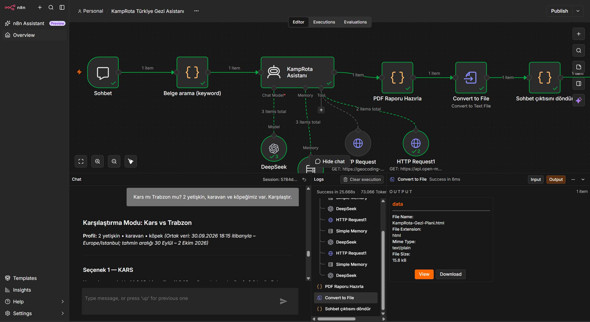
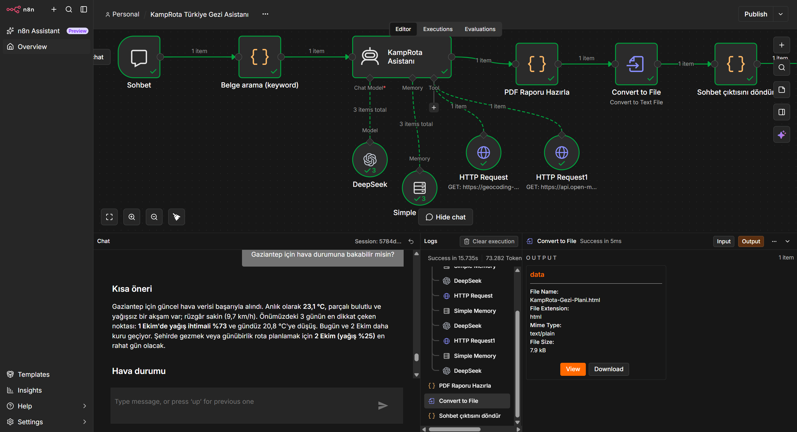
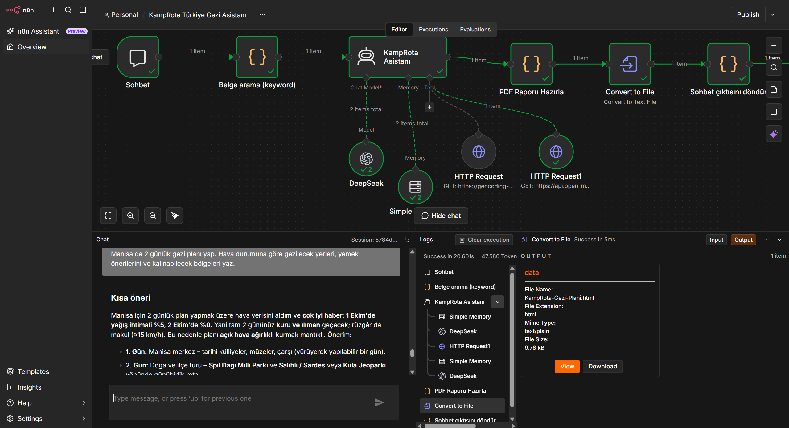

# Week 08 - n8n RAG & AI Agents

## KampRota Türkiye Gezi Asistanı

Bu haftanın çalışmasında n8n üzerinde, Türkçe soruları anlayan ve seyahat planı oluşturan bir RAG tabanlı AI Agent geliştirdik.

KampRota; şehir, hava durumu, konaklama, karavan uygunluğu, evcil hayvan, bütçe ve gezi planı gibi bilgileri tek bir sohbet akışında birleştiren eğitim amaçlı bir asistan prototipidir.

> **Not:** KampRota belgeleri eğitim amacıyla oluşturulmuş kurgusal içeriklerdir. Gerçek rezervasyon, fiyat, yol veya güvenlik kararı için kullanılmamalıdır.

## Neden bu projeyi yaptık?

Sadece soru-cevap yapan bir chatbot yerine, farklı veri kaynaklarını doğru bağlamda kullanabilen daha gerçekçi bir asistan tasarlamak istedik.

Projenin temel fikri şuydu:

> Kullanıcı seyahatini anlatsın; asistan sabit işletme kurallarını belgelerden, güncel bilgileri canlı API'lerden alsın ve sonucu anlaşılır bir gezi raporuna dönüştürsün.

Bu yaklaşım sayesinde modelin her şeyi ezbere cevaplaması yerine, hangi bilginin hangi kaynaktan geldiğini ayırmayı hedefledik.

## Neler geliştirdik?

- n8n üzerinde uçtan uca AI Agent workflow'u
- DeepSeek API ile OpenAI uyumlu chat model bağlantısı
- KampRota belgeleri üzerinde keyword tabanlı RAG
- Konuşma hafızası ile takip sorularına bağlamlı cevap
- Türkiye'deki şehirler için geocoding ve canlı hava durumu sorgusu
- Günlük gezi planı, konaklama ve yemek önerileri
- İki şehir veya rota için karşılaştırma modu
- Hava, yol, bütçe, karavan uzunluğu ve evcil hayvan kriterlerine göre uygunluk değerlendirmesi
- HTML tabanlı, yazdırmaya uygun gezi raporu
- Raporu dosya olarak indirebilme ve PDF'e dönüştürebilme
- İsteğe bağlı e-posta gönderimi için SMTP entegrasyon denemesi

## Workflow mimarisi

```text
Sohbet
  |
  v
Belge arama (keyword)
  |
  v
KampRota Asistanı <--- DeepSeek Chat Model
  |                  <--- Simple Memory
  |                  <--- Geocoding API
  |                  <--- Open-Meteo Weather API
  |
  +--> PDF Raporu Hazırla --> Convert to File --> Sohbet çıktısını döndür
```

## Veri kaynaklarını ayırma yaklaşımı

### Sabit bilgiler - RAG belgeleri

`belgeler/` klasöründeki içerikler KampRota'nın kurgusal sabit bilgisini temsil eder:

- rezervasyon ve fiyatlar
- iptal ve iade koşulları
- tesisler ve olanaklar
- ekipman ve güvenlik notları
- rota ve araç kuralları
- sık sorulan sorular

### Güncel bilgiler - canlı araçlar

Güncel hava durumu için Open-Meteo geocoding ve forecast API'leri kullanıldı. Kullanıcı hangi şehirden bahsediyorsa şehir adı koordinata çevrilir; ardından sıcaklık, yağış ihtimali, rüzgâr ve günlük tahmin alınır.

Sabit KampRota fiyatları ve kuralları canlı servisten tahmin edilmez. Bu ayrım, RAG sisteminin güvenilirliği açısından projenin en önemli tasarım kararlarından biridir.

## Örnek sorular

```text
Gaziantep için 2 günlük gezi planı yap. Hava durumuna göre gezilecek yerleri öner.
```

```text
Kars mı Trabzon mu? 2 yetişkin, 7 metrelik karavan ve köpeğimiz var. 3 günümüz ve gecelik 2000 TL bütçemiz var. Karşılaştır ve en uygun şehri seç.
```

```text
Manisa'da yağış durumuna göre iki günlük gezi planı, yemek önerisi ve konaklama bölgesi hazırla.
```

## Rapor ve PDF çıktısı

Asistan cevabı bir HTML raporuna dönüştürülür. Rapor; başlık, tarih, hava durumu, tablolar, öneriler ve kaynak bilgileriyle yazdırmaya uygun şekilde hazırlanır.

`Convert to File` düğümü dosyayı oluşturur. Dosya tarayıcıda açıldıktan sonra `Ctrl + P -> PDF olarak kaydet` ile PDF'e dönüştürülebilir.

Hazır örnek rapor: [KampRota Gezi Raporu](assets/KampRota-Gezi-Raporu.pdf)

## E-posta entegrasyonu

Raporu e-posta ile göndermek için n8n'deki **Send an Email** düğümü de denendi. Gmail tarafında güvenlik nedeniyle normal hesap şifresi kabul edilmedi ve `535-5.7.8 BadCredentials` hatası alındı.

Bu nedenle e-posta adımı varsayılan akıştan ayrı tutuldu. Gmail ile kullanmak için:

1. Google hesabında iki adımlı doğrulama açılmalı.
2. Google App Password oluşturulmalı.
3. SMTP host `smtp.gmail.com` olmalı.
4. Port `465`, SSL/TLS açık kullanılmalı.
5. Normal Gmail şifresi yerine App Password girilmeli.

API anahtarları ve e-posta şifreleri projeye eklenmemiştir.

Ayrıntılı not: [EMAIL-DURUMU.md](EMAIL-DURUMU.md)

## Klasör yapısı

```text
Week-08-n8n-RAG-AI-Agents/
├── belgeler/
├── workflows/
│   ├── 01-klasik-rag.json
│   ├── 01-deepseek-rag.json
│   ├── 02-agentic.json
│   └── 03-context.json
├── assets/
│   ├── KampRota-Gezi-Raporu.pdf
│   └── screenshots/
├── ARASTIRMA-NOTLARI.md
├── EMAIL-DURUMU.md
├── mail-taslagi.md
├── prompts.md
├── test-sorulari.md
└── test-sorulari.csv
```

## Kurulum özeti

1. n8n'i açın.
2. `01-deepseek-rag.json` workflow'unu içe aktarın.
3. DeepSeek için OpenAI uyumlu credential oluşturun.
4. Base URL olarak `https://api.deepseek.com` kullanın.
5. API anahtarını yalnızca n8n credential alanına girin; GitHub'a göndermeyin.
6. Workflow'u test sorularıyla çalıştırın.

OpenAI embedding kredisi gerektirmeyen keyword RAG sürümü, sınırlı internet ve düşük maliyetli denemeler için özellikle tercih edilmiştir. Klasik vector RAG sürümü de karşılaştırma amacıyla workflow klasöründe tutulmuştur.

## Öğrendiklerimiz

Bu çalışma bize iyi bir AI Agent'ın yalnızca güçlü bir model seçmekten ibaret olmadığını gösterdi. Asıl değer; doğru kaynağı doğru soruyla eşleştirmek, canlı veriyi sabit işletme bilgisinden ayırmak, hataları kullanıcıya anlaşılır biçimde aktarmak ve çıktıyı gerçek hayatta kullanılabilir bir rapora dönüştürmekte ortaya çıktı.

Özellikle API parametrelerinin türleri, tool bağlantıları, şehir adının koordinata çevrilmesi, hafıza kullanımı ve dosya çıktısının sohbet cevabını bozmaması üzerinde çalıştık. Bu nedenle proje, basit bir chatbot örneğinden çok; RAG, tool calling, memory ve workflow orchestration kavramlarını birlikte gösteren küçük bir uygulama laboratuvarına dönüştü.

## Sınırlamalar ve sonraki adımlar

- KampRota bilgi bankası şu anda kurgusaldır.
- Hava durumu verileri değişebilir; kesin güvenlik garantisi verilmez.
- Gerçek yol durumu için ayrıca güvenilir ve güncel bir yol servisi bağlanmalıdır.
- PDF üretimi şu anda HTML çıktısının yazdırılmasıyla tamamlanmaktadır.
- Gmail gönderimi için App Password veya başka bir SMTP sağlayıcısı gerekir.
- Bir sonraki adımda gerçek tesis verileri, daha güçlü semantik retrieval ve gerçek PDF üretim servisi eklenebilir.

## Görseller







